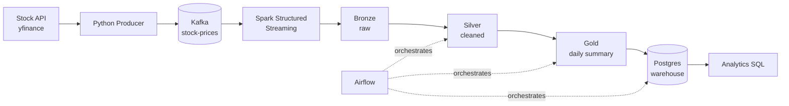
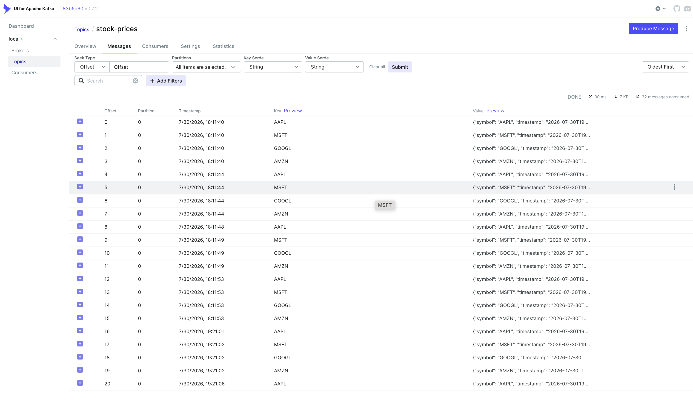
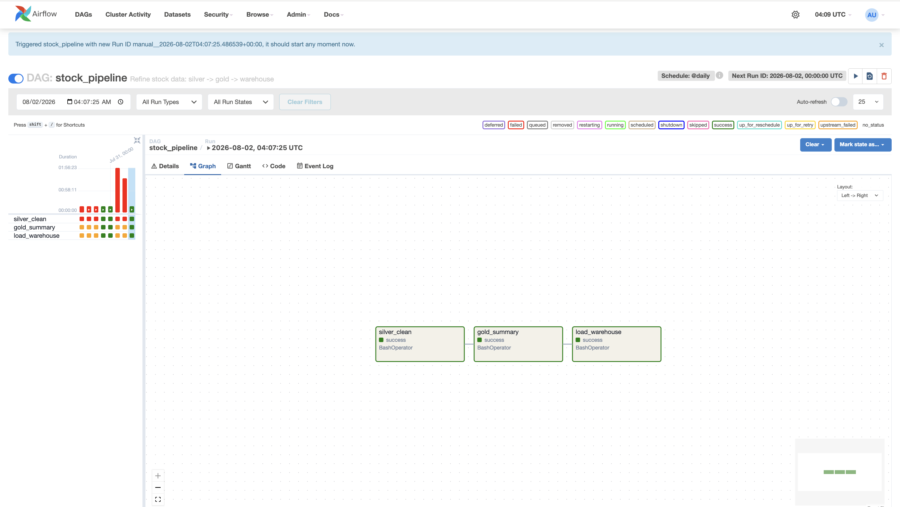
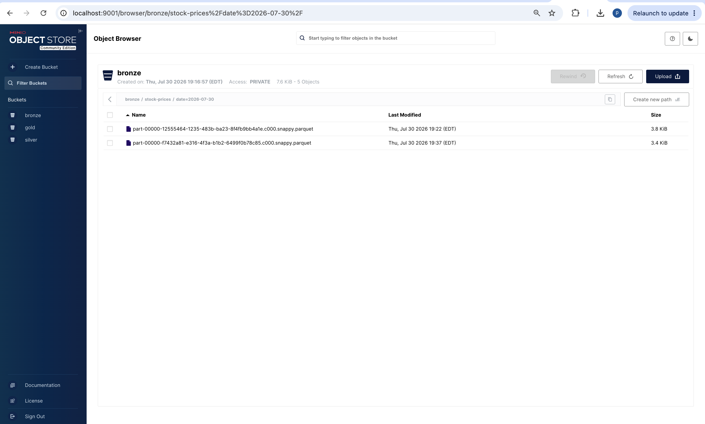
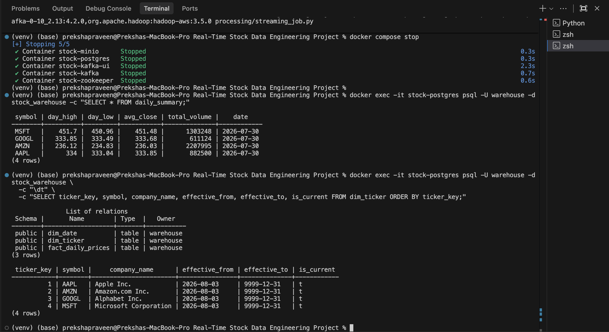

# Real-Time Stock Data Engineering Pipeline

An end to end streaming pipeline that ingests live stock market data, processes it in real
time through a bronze/silver/gold data lake, and loads it into a warehouse for analytics.

## Why this project?

Stock prices change constantly while the market is open, and the data loses value quickly as
it ages. That makes it a natural fit for streaming rather than batch: instead of waiting for a
once a day job, this pipeline reacts to new prices as they arrive, so a dashboard or an alert
can work off near real time data. The business problem it solves is keeping an analytics
warehouse continuously up to date with fresh market data, so analysts can answer questions
like "which stock moved the most today?" without waiting for tomorrow's load. It also serves
as a hands on reference for the streaming plus medallion (bronze/silver/gold) pattern that is
common across the industry.

## Tech stack

Python, Kafka, Spark Structured Streaming, Airflow, MinIO, PostgreSQL, Docker.

## Architecture



A polished diagram will replace this later. See [docs/architecture.md](docs/architecture.md)
for the data contract, topic design, and failure scenarios.

## Sample event

Each Kafka message is one price observation for one ticker, keyed by its symbol:

```json
{
  "symbol": "AAPL",
  "timestamp": "2026-08-01T19:59:00Z",
  "open": 210.10,
  "high": 210.55,
  "low": 209.80,
  "close": 210.35,
  "volume": 882500,
  "source": "yfinance",
  "interval": "1m",
  "currency": "USD",
  "ingested_at": "2026-08-01T19:59:04Z"
}
```

## Getting started

Prerequisites: Docker Desktop and Python 3.

```bash
# Python environment
python3 -m venv venv
source venv/bin/activate
pip install -r requirements.txt

# Configuration: copy the template, then fill in your values
cp .env.example .env

# Start the local stack
docker compose up -d
```

Handy URLs once the stack is up:
- MinIO console: http://localhost:9001
- Kafka UI: http://localhost:8080

Stop the stack with `docker compose down`.

## Tests

```bash
pytest
```

Unit tests cover the transform logic (deduplication, aggregation, the date dimension) and the
producer's record shaping, run on small in-memory data with external systems mocked.

## Screenshots

**Kafka UI, live messages in the `stock-prices` topic**



**Airflow, the pipeline DAG running green**



**MinIO, the bronze / silver / gold data lake**



**Postgres, the Gold daily summary table**



## Repository layout

```
ingestion/    stock data producer
processing/   Spark streaming (bronze) and batch jobs (silver, gold)
warehouse/    load into Postgres and analytics SQL
dags/         Airflow DAG that orchestrates the pipeline
docs/         architecture notes and diagrams
```
```

