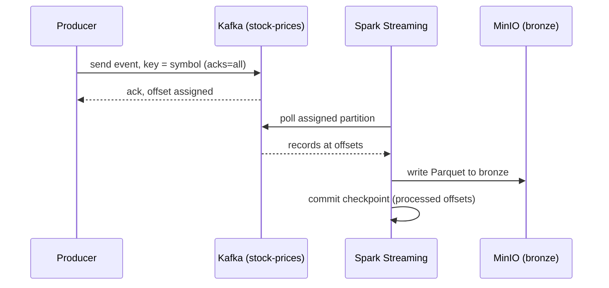

# Architecture

## Overview

The pipeline ingests live stock market data, processes it through a layered
(bronze / silver / gold) data lake, and loads analytics ready tables into Snowflake.

```
Stock API (Yahoo Finance / Alpha Vantage)
  -> Python producer
  -> Kafka (with Zookeeper)
  -> Spark Structured Streaming
  -> Bronze layer (MinIO, raw Parquet)
  -> Silver layer (cleaned, validated)
  -> Gold layer (star schema)
  -> Snowflake
  -> Analytics SQL
```

Airflow orchestrates the batch jobs, including retries, backfills, and task dependencies.
All services run locally with Docker Compose, and PostgreSQL backs the Airflow metadata.

## Components

* Python producer: polls the stock API and publishes events to a Kafka topic.
* Kafka and Zookeeper: a durable, ordered, replayable event log.
* Spark Structured Streaming: consumes Kafka and writes raw events to the bronze layer.
* MinIO: S3 compatible object storage for the data lake.
* Spark batch jobs: clean bronze into silver and model silver into a gold star schema.
* Airflow: orchestrates the batch jobs.
* Snowflake: the analytics warehouse.

## Data contract: stock event

Each Kafka message represents one observation of one ticker at one point in time. All
timestamps are UTC (ISO-8601). Prices are decimal.

| Field | Type | Description |
| ----- | ---- | ----------- |
| symbol | string | ticker, e.g. AAPL |
| timestamp | string | when the observation is for (event time) |
| open | decimal | opening price of the bar |
| high | decimal | highest price of the bar |
| low | decimal | lowest price of the bar |
| close | decimal | closing price of the bar |
| volume | integer | shares traded in the bar |
| source | string | data provenance, e.g. yfinance |
| interval | string | bar resolution, e.g. 1m |
| currency | string | price units, e.g. USD |
| ingested_at | string | when the producer fetched it (processing time) |

The natural key is (symbol, timestamp): it uniquely identifies one observation and is used
downstream for deduplication and idempotency. The producer polls each ticker on a
configurable interval (default 60 seconds).

## Kafka topic design

| Setting | Value | Reason |
| ------- | ----- | ------ |
| topic | stock-prices | single topic for all tickers |
| partitions | 5 | allows up to 5 parallel consumers; enough for a handful of tickers |
| message key | symbol | routes all events for a ticker to one partition, preserving per-ticker order |
| replication factor | 1 | single broker locally; would be 3 in production for fault tolerance |
| retention | 7 days (default) | keeps messages after consumption to allow replay |

Kafka guarantees ordering only within a partition. Keying by symbol keeps each ticker's
events ordered, which is what matters for time-series prices. Ordering across different
tickers is not required.

## Failure scenarios and defenses

| Failure | What happens | Defense |
| ------- | ------------ | ------- |
| Stock API down or slow | A fetch hangs or errors | Request timeout, bounded retries with exponential backoff, then skip the cycle, log and emit a metric. Never crash, never block forever. The next cycle retries; gaps can be backfilled. |
| Producer to Kafka write not durable | Message acknowledged but not safely stored | acks=all and producer retries for durability. The kafka-python-ng client has no idempotent-producer mode, so a retry may create a duplicate; duplicates are removed downstream by the natural key (symbol, timestamp) in the silver job. |
| Spark crashes before checkpoint | On restart it reprocesses the same offset and writes the record to bronze twice | At-least-once processing plus deduplication on the natural key (symbol, timestamp) in the silver layer. |
| Duplicates in general | Same observation appears more than once | Deduplicate on the natural key (symbol, timestamp). |
| Kafka unavailable | Producer cannot send | Producer buffers and retries; alert if the buffer fills. Messages already in Kafka are retained for 7 days for replay. |

## Event flow



## Scalability

Partitions are the unit of parallelism: the number of consumers in a group cannot exceed
the number of partitions. Partition count is therefore a capacity decision made upfront,
since adding partitions later changes the key to partition mapping. The producer scales
horizontally by splitting the ticker list across multiple instances. Kafka scales by adding
brokers and raising the replication factor. At high message rates the bronze layer must
avoid the small files problem through batching and compaction.

## Storage

MinIO exposes an S3 compatible API on port 9000 and a web console on port 9001. Objects are
stored in a Docker named volume so data persists across container restarts.

Configuration is injected through environment variables. Secrets are never committed to
source control.
